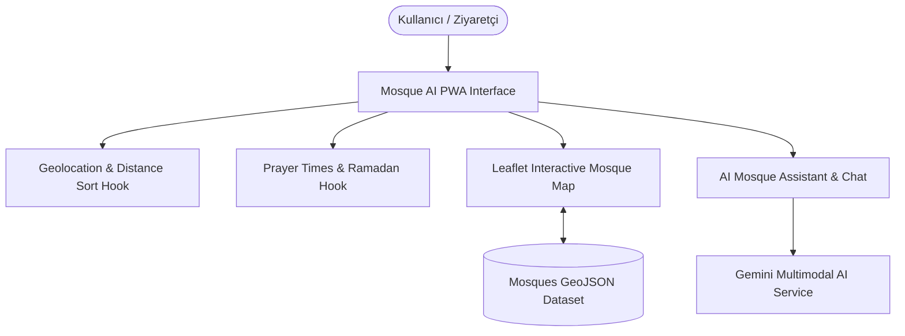

# 🕌 Mosque AI - Smart Historical Mosque Explorer & Prayer Guide

[](https://www.typescriptlang.org/)
[](https://reactjs.org/)
[](https://vitejs.dev/)
[](https://leafletjs.com/)
[](https://web.dev/progressive-web-apps/)
[](https://deepmind.google/technologies/gemini/)
[](https://www.yucelgumus.dev/)

> Türkiye genelindeki tarihi ve mimari camileri interaktif harita üzerinde sergileyen, **Google Gemini AI** destekli rehberlik ve soru-cevap asistanı, anlık namaz vakitleri, mesafe sıralaması ve çevrimdışı PWA desteği sunan kapsamlı kültürel miras platformu.

---

## 🌟 Öne Çıkan Özellikler

- 🗺️ **Kapsamlı GeoJSON Cami Haritası:** Yüzlerce tarihi caminin mimari dönemlerini, kapasitelerini, banilerini ve konumlarını içeren zengin harita katmanı.
- 🤖 **Yapay Zeka Cami Asistanı (`AIAssistant`):** Seçilen veya merak edilen caminin tarihi, mimari özellikleri (kubbe yapısı, hat sanatı, çiniler) hakkında Gemini AI ile sohbet etme.
- ⏱️ **Gerçek Zamanlı Namaz Vakitleri:** Kullanıcının konumuna göre anlık ezan saatleri ve Ramazan imsakiye banner entegrasyonu (`PrayerTimesPanel.tsx`).
- 📍 **Konuma Göre Mesafe Sıralaması:** Geolocation API ile kullanıcıya en yakın tarihi camileri mesafeye göre sıralama (`useDistanceSort.ts`).
- 📱 **Progressive Web App (PWA):** Mobil cihazlara uygulama gibi yüklenebilme ve hızlı önbellekleme desteği.

---

## 🏗️ Mimari & Modül Yapısı



| Özellik Alanı | İlgili Dizin / Dosya | Açıklama |
| :--- | :--- | :--- |
| **Cami Haritası & Katmanlar** | `src/features/mosques/components/MosqueMap/` | Leaflet haritası, kümeleme ve özel ikonlar |
| **Yapay Zeka Rehberi** | `src/features/mosques/components/AIAssistant/` | Gemini AI tarihi sohbet bileşeni |
| **Namaz Vakitleri** | `src/features/mosques/components/PrayerTimesPanel/` | Anlık vakitler ve geri sayım sayacı |
| **Durum Yönetimi** | `src/features/mosques/store/mosqueStore.ts` | Seçili cami, filtreler ve arama state'i |

---

## 🚀 Hızlı Başlangıç

### Gereksinimler
- **Node.js**: v18.0+
- **Google Gemini API Key**

### Kurulum

```bash
git clone https://github.com/yucel-gumus/mosque_ai.git
cd mosque_ai

npm install
```

### Ortam Değişkenleri (`.env`)

```env
VITE_GEMINI_API_KEY=your_gemini_api_key_here
```

### Çalıştırma

```bash
npm run dev
```

---

## 📂 Proje Dizin Yapısı

```
mosque_ai/
├── public/
│   ├── mosques-geojson.json        # Cami coğrafi ve tarihi veri seti
│   └── manifest.json               # PWA yapılandırması
├── package.json
├── vite.config.ts
└── src/
    ├── main.tsx
    ├── App.tsx
    ├── features/mosques/
    │   ├── components/             # Harita, asistan, namaz vakitleri, filtreler
    │   ├── hooks/                  # Mesafe sıralama, coğrafi konum, sesli sohbet
    │   ├── services/               # Fotoğraf ve AI servisleri
    │   ├── store/                  # Cami durumu (Zustand)
    │   └── utils/                  # Harita katmanları ve Ramazan hesaplayıcıları
    └── shared/                     # Ortak bileşenler, UI kütüphanesi ve hata yakalayıcı
```

---

## 📄 Lisans
Bu proje [MIT Lisansı](LICENSE) ile lisanslanmıştır.

---

## 👨‍💻 Geliştirici & İletişim

**Yücel Gümüş** - Full Stack Developer

- 🌐 **Web Sitesi / Portfolyo:** [yucelgumus.dev](https://www.yucelgumus.dev/)
- 💼 **LinkedIn:** [linkedin.com/in/yucel-gumus](https://www.linkedin.com/in/yucel-gumus/)
- 🐙 **GitHub:** [@yucel-gumus](https://github.com/yucel-gumus)

<p align="left">
  <a href="https://www.yucelgumus.dev/" target="_blank" rel="noopener noreferrer">
    
  </a>
</p>